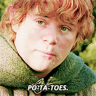
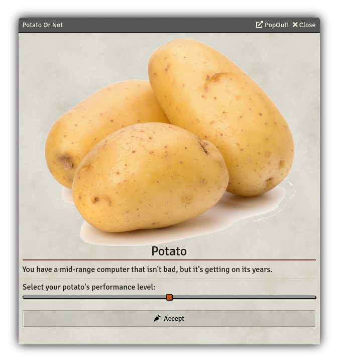

# Potato Or Not

   

---

A module made by Fantasy Computerworks.

Other works by us:
- [Fantasy Calendar](https://app.fantasy-calendar.com) - The best calendar creator and management app on the internet
- [Sequencer](https://foundryvtt.com/packages/sequencer) - Wow your players by playing visual effects on the canvas
- [Item Piles](https://foundryvtt.com/packages/item-piles) - Drag & drop items into the scene to drop item piles that you can then easily pick up
- [Tagger](https://foundryvtt.com/packages/tagger) - Tag objects in the scene and retrieve them with a powerful API
- [Token Ease](https://foundryvtt.com/packages/token-ease) - Make your tokens _feel good_ to move around on the board

Like what we've done? Buy us a coffee!

---

Is your computer a potato? Is your players' computers potatoes? Are they scared of navigating interfaces?

Presenting, **Potato Or Not**!

This modules provides a quick way to prompt your players how fast their computer is, and set their graphics settings accordingly.

---

# API Documentation

## Constants

### <code>PotatoOrNot.quality</code>

Sets the graphic quality of the client and update settings associated with that quality level

| Param | Type | Range |
| --- | --- | --- |
| quality | <code>number</code> | 0-2 |

---

## Functions

### <code>PotatoOrNot.showDialog</code>

Locally prompts the dialogue

Returns <code>FormApplication</code>

---

### <code>PotatoOrNot.getSetting</code>

Gets the value of a setting of a module at a quality level

| Param | Type |
| --- | --- |
| quality_level | <code>number</code> |
| module | <code>string</code> |
| setting | <code>string</code> |

Returns <code>\*</code> on success

---

### <code>PotatoOrNot.addSetting</code>

Adds a setting to be applied on a quality level - can be forced to be applied immediately (if quality level matches)

| Param | Type |
| --- | --- |
| quality_level | <code>number</code> |
| module | <code>string</code> |
| setting | <code>string</code> |
| value | <code>\*</code> |
| force | <code>bool</code> |

Returns <code>bool</code> on success

---

### <code>PotatoOrNot.removeSetting</code>

Removes a setting from a quality level

| Param | Type |
| --- | --- |
| quality_level | <code>number</code> |
| module | <code>string</code> |
| setting | <code>string</code> |

Returns <code>bool</code> on success
